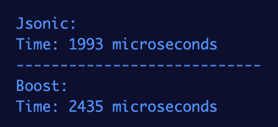
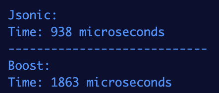
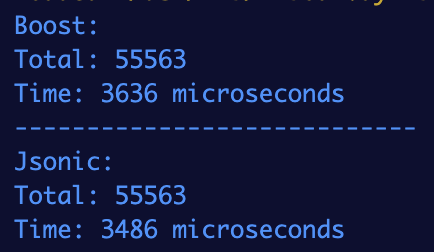

# Jsonic

[](https://github.com/rohanrhu/jsonic/issues)
[](https://github.com/rohanrhu/jsonic/network)
[](https://github.com/rohanrhu/jsonic/stargazers)
[](https://patreon.com/EvrenselKisilik)
[](#donation)

High performance tricky and dumb JSON reader for C/C++ that can be super fast if you use it correctly.

## Performance

Benchmarks are found in `benchmark/` folder.

### Benchmark for `twitter.json`

Here is `twitter.json` benchmark results for Jsonic vs Boost.JSON:

| `statuses[].id`, `statuses[].text`, `statuses[].user.name`                     | `statuses[].id` only                                                               |
|--------------------------------------------------------------------------------|------------------------------------------------------------------------------------|
|  |  |

### Benchmark for `canada.json`

Here is `canada.json` benchmark results for Jsonic vs Boost.JSON:



For this benchmark, the winner was changing for each time so I just choosed one of times that Jsonic was winner for adding here :)

### More Details About Benchmarks

| Condition     | Benchmarked on                                           |
| ------------- | -------------------------------------------------------- |
| **CPU:**      | Apple M1                                                 |
| **OS:**       | MacOS Ventura                                            |
| **Compiler:** | CLang (Apple clang version 14.0.0 (clang-1400.0.29.202)) |
| **Flags:**    | -O3                                                      |

Actually I'm very lazy for benchmarks, `canada.json` benchmark was originated from @RoyBellingan you can find the first results [here](https://gist.github.com/RoyBellingan/54e82fb2933db3982606a31b5d26e1e9) that were just before latest performance enhancements I've just made on Jsonic.

`twitter.json` benchmark is a simple example for Jsonic's dumb philosophy. I will make benchmarks for more complicated real-world scenarios, especially for kinda search-purposed scenarios that are what Jsonic is super fast for.

Examples are not benchmarks. The documentation and examples have bad and good usages of Jsonic to tell you how to use it with the correct way that makes Jsonic super fast!

## Jsonic Philosophy

Jsonic is designed to work with your own iterations for your specific use cases. Please read the documentation and work on examples carefully.

## Including and Compiling

### Including

```c
#include "jsonic.h"
```

### Building and Linking

You can just build and link `jsonic.o` and use `jsonic.h`. Don't forget to use `-O3` flag for compilation.

Using `make` will build Jsonic and examples:

```bash
cd /path/to/jsonic
make
cd /path/to/your/project
gcc -o example.exe example.c /path/to/jsonic/jsonic.o -I /path/to/jsonic
```

## Reading JSON

### Jsonic Node

Every JSON result is a `jsonic_node_t` object in jsonic.

```c
typedef struct jsonic_node jsonic_node_t;
struct jsonic_node {
    char* key;
    char* val;
    jsonic_node_type_t type;
    unsigned int len;
    unsigned int pos;
    unsigned int ending;
    ...
};
```

You will use structure members: `type`, `key`, `val`, `len` and `pos` for reading JSON.

`val` is useable for **string**, **number**, **boolean** and **null** types. `val` is a NULL Terminated String and you can get length of string via `len` for string values.
`pos` is useable for getting iteration position for arrays/objects.

`key` is useable NULL Terminated String for Key=>Value iteration results.

#### String Values

String values come as NULL Terminated String in `val` and you can check them with `node->type == JSONIC_STRING`.

#### Number Values

Number values come as NULL Terminated String in `val` and you can check them with `node->type == JSONIC_NUMBER`.

#### Boolean Values

Boolean values come as NULL Terminated String in `val`. `val` maybe `"1"` or `"0"` for boolean values and you can check them with `node->type == JSONIC_BOOLEAN`.

#### Null Values

Null values come as NULL Terminated String in `val` as `"0"` and you can check them with `node->type == JSONIC_NULL`.

#### Result Length

`len` is useable for **string**, **number**, **boolean** and **null** types and does not give length of an **array**.
You can use [jsonic_array_length()](#jsonic_array_length) or [jsonic_array_length_from()](#jsonic_array_length_from) for getting an array's length.

The length will be found in `result.length` and the position index of the rest of JSON will be found in `result.index`.

If you are going to get something from the rest of JSON just after counting previous object which is an array, you can just use `result.index` as from position.
There is `jsonic_from_length()` that simply returns `length.index`.

Jsonic will already manage it in a scenario like this:

```c
jsonic_length_t count = jsonic_array_length(json_string, powers);
printf("Powers (%d total):\n", jsonic_array_length(json_string, powers).length);

meow = jsonic_object_iter(json_string, member, powers, "meow");
printf("Meow: %s\n", meow->val); // ! purr
// ! This following tricky usage is the same of the above one because Jsonic already knows
// ! that we already iterated chars to get the length of `powers` array, so you don't need to do this.
meow = jsonic_object_iter_index(json_string, member, powers, jsonic_from_length(count), "meow");
printf("Meow: %s\n", meow->val); // ! purr
```

#### Iteration Position

`node->pos` is useable for objects and arrays both. It gives current index of current iterated array item or object key&value.
Also you can use it for not found result nodes.

### JSON Types

```c
enum JSONIC_NODE_TYPES {
    JSONIC_NONE,
    JSONIC_OBJECT,
    JSONIC_ARRAY,
    JSONIC_STRING,
    JSONIC_NUMBER,
    JSONIC_BOOLEAN,
    JSONIC_NULL
};
typedef enum JSONIC_NODE_TYPES jsonic_node_type_t;
```

#### Not Found Results

You will get a node with type `JSONIC_NONE` for not found results and of course you need freeing it.

##### Checking Length for Not Found Results

You can check how many items itered at total including searching the not found result node with `node->pos`.

###### Examples

```c
jsonic_node_t* not_exists_key = jsonic_object_get(json_string, root, "not_exists_key");
printf("Count: %d\n\n", not_exists_key->pos); // not_exists_key->pos+1 is how many items itered.
```

```c
jsonic_node_t* an_exists_key = jsonic_object_get(json_string, root, "an_exists_key");
jsonic_node_t* not_exists_key = jsonic_object_iter(json_string, root, an_exists_key, "not_exists_key");

// not_exists_key->pos+1 is how many items itered at total including an_exists_key.
printf("Count: %d\n\n", not_exists_key->pos);
```

```c
jsonic_node_t* not_exists_item = jsonic_array_get(json_string, array, 100);
printf("Count: %d\n\n", not_exists_item->pos); // not_exists_item->pos+1 is how many items itered.
```

```c
jsonic_node_t* not_exists_item = jsonic_array_iter(json_string, array, exists_item, 100);
printf("Count: %d\n\n", not_exists_item->pos); // not_exists_item->pos+1 is how many items itered at total.
```

### Functions

There are various functions in Jsonic for walking and iterating on JSON.

#### jsonic_from_file()

```c
char* jsonic_from_file(char* fname);
```

#### jsonic_free()

```c
void jsonic_free(jsonic_node_t** node);
```

Example:

```c
jsonic_node_t* members = jsonic_object_get(json_string, jsonic_get_root(json_string), "members");
...
jsonic_free(&members); // free'd and members is set to NULL
```

#### jsonic_free_addr()

```c
void jsonic_free_addr(jsonic_node_t* node);
```

#### jsonic_get_root()

```c
jsonic_node_t* jsonic_get_root(char* json_str);
```

##### Checking Root

```c
jsonic_node_t* root = jsonic_get_root(json_string);

if (root->type == JSONIC_NONE) {
    printf("JSON root is none.\n");
} else if (root->type == JSONIC_OBJECT) {
    printf("JSON root is an object.\n");
} else if (root->type == JSONIC_ARRAY) {
    printf("JSON root is an array.\n");
} else if (root->type == JSONIC_STRING) {
    printf("JSON root is a string.\n");
} else if (root->type == JSONIC_NUMBER) {
    printf("JSON root is a number.\n");
} else if (root->type == JSONIC_BOOLEAN) {
    printf("JSON root is a boolean.\n");
} else if (root->type == JSONIC_NULL) {
    printf("JSON root is null.\n");
}
```

#### jsonic_object_get()

```c
jsonic_node_t* jsonic_object_get(char* json_str, jsonic_node_t* current, char* key);
```

##### Get an Object Key

Get a key from JSON root:

```c
jsonic_object_get(json_string, jsonic_get_root(json_string), "someKey");
```

or find an existing node:

```c
jsonic_object_get(json_string, some_object, "someKey");
```

#### jsonic_array_get()

```c
jsonic_node_t* jsonic_array_get(char* json_str, jsonic_node_t* current, int index);
```

##### Get an Element of Array

Get an array element from JSON Array root:

```c
jsonic_array_get(json_string, jsonic_get_root(json_string), 5);
```

or find an existing node:

```c
jsonic_array_get(json_string, some_array, 5);
```

##### Inline Usage

If you are using these functions as inline, application will have memory leaks and it will be non-memory-safe, so you may get `SIGSEGV`!

```c
extern jsonic_node_t* jsonic_get_root(char* json_str);
extern jsonic_node_t* jsonic_object_get(char* json_str, jsonic_node_t* current, char* key);
extern jsonic_node_t* jsonic_object_iter(char* json_str, jsonic_node_t* current, jsonic_node_t* from, char* key);
extern jsonic_node_t* jsonic_object_iter_free(char* json_str, jsonic_node_t* current, jsonic_node_t* from, char* key);
extern jsonic_node_t* jsonic_object_iter_kv(char* json_str, jsonic_node_t* current, jsonic_node_t* from);
extern jsonic_node_t* jsonic_object_iter_kv_free(char* json_str, jsonic_node_t* current, jsonic_node_t* from);
extern jsonic_node_t* jsonic_array_get(char* json_str, jsonic_node_t* current, int index);
extern jsonic_node_t* jsonic_array_iter(char* json_str, jsonic_node_t* current, jsonic_node_t* node, int index);
extern jsonic_node_t* jsonic_array_iter_free(char* json_str, jsonic_node_t* current, jsonic_node_t* node, int index);
```

###### Memory-Safety Example

Non-memory-safe usage:

```c
printf("Squad: %s\n", jsonic_object_get(json_string, jsonic_get_root(json_string), "squadName")->val);
```

This is memory-safe usage:

```c
jsonic_node_t* root = jsonic_get_root(json_string);
jsonic_node_t* name = jsonic_object_get(json_string, root, "squadName");

if (name != NULL) {
    if (name->type == JSONIC_STRING) {
        printf("Squad: %s\n", name->val);
    }

    jsonic_free(&name);
}

jsonic_free(&root);
```

#### jsonic_array_length()

```c
jsonic_length_t jsonic_array_length(char* json_str, jsonic_node_t* array);
```

#### jsonic_array_length_from()

```c
jsonic_length_t jsonic_array_length_from(char* json_str, jsonic_node_t* array, jsonic_node_t* from);
```

#### jsonic_array_iter()

```c
jsonic_node_t* jsonic_array_iter(char* json_str, jsonic_node_t* current, jsonic_node_t* node, int index);
```

Useable for iterating arrays. Starts reading from given `node` in `current`, so `index` parameter must start from `0`, it will start reading from given `node`.

#### jsonic_array_iter_free()

```c
jsonic_node_t* jsonic_array_iter_free(char* json_str, jsonic_node_t* current, jsonic_node_t* node, int index);
```

Same as `jsonic_array_iter()` but frees given jsonic object (`node`).

##### Iterating Arrays

You can use `jsonic_array_iter()` or `jsonic_array_iter_free()`.

```c
jsonic_node_t* power = NULL;
for (;;) {
    power = jsonic_array_iter_free(json_string, powers, power, 0);
    if (power->type == JSONIC_NONE) break;
}
```

**Notice:** Using `jsonic_array_iter()` instead of `jsonic_array_iter_free()` would be non-memory safe for most of times.

#### jsonic_object_iter()

```c
jsonic_node_t* jsonic_object_iter(char* json_str, jsonic_node_t* current, jsonic_node_t* from, char* key);
```

Useable for getting a key's value with more performance. It starts reading from given `node` in `current`.

**Notice:** You must be sure your key is located after given `node` in JSON.

#### jsonic_object_iter_free()

```c
jsonic_node_t* jsonic_object_iter_free(char* json_str, jsonic_node_t* current, jsonic_node_t* from, char* key);
```

Same as `jsonic_object_iter()` but frees given jsonic object (`from`).

#### jsonic_object_iter_kv()

```c
jsonic_node_t* kv = jsonic_object_iter_kv(json_string, current, from);
```

Useable for object iteration as `key: value` pairs in `current` starting from `from`.

#### jsonic_object_iter_kv_free()

```c
jsonic_node_t* kv = jsonic_object_iter_kv_free(json_string, current, from);
```

Same as `jsonic_object_iter_kv()` but frees given jsonic object (`from`).

##### Iterating Objects with a Key

You can use `jsonic_object_iter()` or `jsonic_object_iter_free()`.

```c
jsonic_node_t* node = jsonic_object_iter(json_string, something, previousNode, "someKey");
```

##### Iterating Objects as `Key: Value` Pairs

You can use `jsonic_object_iter_kv()` or `jsonic_object_iter_kv_free()`.

```c
jsonic_node_t* key = NULL;
for (;;) {
    key = jsonic_object_iter_kv_free(json_string, keys, key);
    if (key->type == JSONIC_NONE) break;
    
    if ((key->type == JSONIC_STRING) || (key->type == JSONIC_NUMBER)) {
        printf("%s => %s\n", key->key, key->val);
    }
}
```

## Work under the hood?

Sometimes, you may want to be more ticky. Here is `jsonic_get()`:

```c
extern jsonic_node_t* jsonic_get(
    char* json_str,
    jsonic_node_t* current,
    char* key,
    unsigned int index,
    unsigned int from,
    jsonic_node_t* from_object,
    int is_get_root,
    int is_kv_iter
)
```

## Compile and Run Examples

You can compile and run examples in `examples/` directory:

```bash
cd examples/heroes
make
```

and run on Windows:

```bash
heroes.exe
```

on Linux:

```bash
./heroes.exe
```

## Example

An example for reading JSON data

```c
char* json_string = jsonic_from_file("heroes.json");

if (json_string == NULL) {
    printf("JSON file not found.\n");
    exit(0);
}

jsonic_node_t* root = jsonic_get_root(json_string);

jsonic_node_t* members = jsonic_object_get(json_string, root, "members");
jsonic_node_t* member = jsonic_array_get(json_string, members, 1);
jsonic_node_t* powers = jsonic_object_get(json_string, member, "powers");

// ! inline usage: non-free'd nodes and non-safe pointers!..
// using jsonic_object_get() is poor way because of reading it from start of json each time!
// use jsonic_object_iter() or jsonic_object_iter_free() instead of jsonic_object_get().
// ! don't use jsonic_object_get() for sequenced items, use jsonic_object_iter() instead!
printf("Squad: %s\n", jsonic_object_get(json_string, root, "squadName")->val);
printf("Active: %s\n", jsonic_object_get(json_string, root, "active")->val);
printf("Formed: %s\n", jsonic_object_get(json_string, root, "formed")->val);
printf("Name: %s\n", jsonic_object_get(json_string, member, "name")->val);
printf("Age: %s\n", jsonic_object_get(json_string, member, "age")->val);

jsonic_length_t count = jsonic_array_length(json_string, powers);
printf("Powers (%d total):\n", count.length);

jsonic_node_t* meow;

// * More performance...
meow = jsonic_object_iter(json_string, member, powers, "meow");
printf("Meow: %s\n", meow->val); // ! purr
// * This following tricky usage is the same of the above one because Jsonic already knows
// * that we already iterated chars to get the length of `powers` array, so you don't need to do this.
meow = jsonic_object_iter_index(json_string, member, powers, jsonic_from_length(count), "meow");
printf("Meow: %s\n", meow->val); // ! purr

jsonic_node_t* power = NULL;
for (;;) {
    power = jsonic_array_iter_free(json_string, powers, power, 0);
    if (power->type == JSONIC_NONE) break;
    
    if (power->type == JSONIC_STRING) {
        jsonic_length_t count = jsonic_array_length_from(json_string, powers, power);
        
        printf(
            "\t%s (pos: %d, from len: %d)\n",
            power->val,
            power->pos,
            count.length
        );
    }
}

jsonic_free(&members);
jsonic_free(&member);
jsonic_free(&powers);
jsonic_free(&root);
free(json_string);
```

Example JSON (heroes.json):

```json
{
    "squadName": "Super \"hero\" squad",
    "homeTown": "Metro City",
    "formed": 2016,
    "secretBase": "Super tower",
    "active": true,
    "members": [
    {
        "name": "Molecule Man",
        "age": 29,
        "secretIdentity": "Dan Jukes",
        "powers": [
            "Radiation resistance",
            "Turning tiny",
            "Radiation blast"
        ],
        "meow": "purr"
    },
    {
        "name": "Madame Uppercut",
        "age": 39,
        "secretIdentity": "Jane Wilson",
        "powers": [
            "Million tonne punch",
            "Damage resistance",
            "Superhuman reflexes"
        ],
        "meow": "purr"
    },
    {
        "name": "Eternal Flame",
        "age": 1000000,
        "secretIdentity": "Unknown",
        "powers": [
            "Immortality",
            "Heat Immunity",
            "Inferno",
            "Teleportation",
            "Interdimensional travel"
        ],
        "meow": "purr"
    }
    ]
}

```

## JSON Type Checking

You must check JSON node for `jsonic_object_get()` or `jsonic_array_get()` from it. Otherwise you will get some absurd data. (e.g. Trying get a key's value from an array.)

## Syntax Checking

This library does not check JSON syntax, so you may get `SIGSEGV` or maybe infinite loops for **corrupt JSONs**. Likewise in some cases of corrupt JSONs, it would work as properly.

## Donation

You can donate for supporting me :)

| Currency | Address                                    |
| -------- | ------------------------------------------ |
| BTC      | 3KBtYfaAT42uVFd6D2XFRDTAoErLz73vpL         |
| USDT     | 0xCa422B014A6F588606864ef2d0C40ec2E5d83DFE |
| USDC     | 0xCa422B014A6F588606864ef2d0C40ec2E5d83DFE |

## License

Copyright (C) 2018, Oğuzhan Eroğlu <rohanrhu2@gmail.com> (https://oguzhaneroglu.com/)

This work is licensed under the terms of the MIT license.  
For a copy, see <https://opensource.org/licenses/MIT>.
